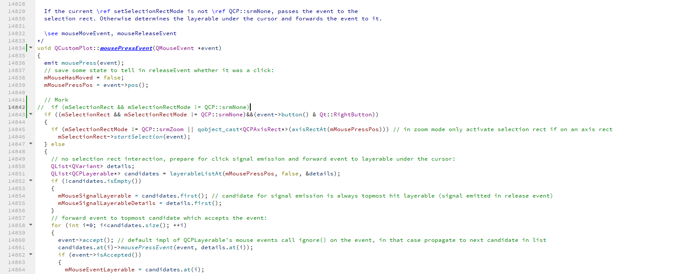

# 解决QCustomPlot不能同时拖拉和拉框放大的问题
如下图修改为只有右键拉框才放大。同时如果打开了拖拉功能，则左键允许拖拉
```
// 修改前
// if (mSelectionRect && mSelectionRectMode != QCP::srmNone)
// 修改后
if ((mSelectionRect && mSelectionRectMode != QCP::srmNone)&&(event->button() & Qt::RightButton))

ui->osc->setInteraction(QCP::iRangeDrag,true);  // 使能拖拉功能
```
